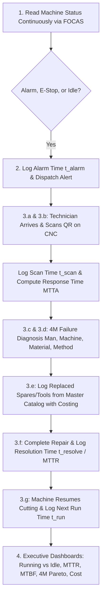

# CNC Machine Maintenance & Downtime Tracking System

A full-stack, industrial-grade **Computerized Maintenance Management System (CMMS / TPM)** tailored for CNC machine shops. Built with **Python Django 5**, **MySQL**, and integrated directly with **FANUC FOCAS CNC controllers (`Fwlib64.dll`)** to track real-time machine telemetry, physical QR attendance, 4M root-cause analysis, spare parts costing, and executive KPI analytics.

---

## 🏭 Core Workflow (From Shop-Floor Engineering Notes)



---

## 🚀 Key Features

1. **Continuous FOCAS Telemetry Ingestion (`maintenance/focas/`)**:
   - Native Ctypes wrapper for FANUC `Fwlib64.dll` (`cnc_allclibhndl3`, `cnc_statinfo`, `cnc_freelibhndl`).
   - Decodes controller status: `RUNNING` (Cycle active), `IDLE` (Spindle stopped), `ALARM` (Alarm bit set), and `EMERGENCY_STOP` (E-Stop button pressed).
   - Built-in interactive **CNC Simulator** for testing without physical machines.
2. **Physical On-Site QR Verification**:
   - High-resolution printable QR stickers for each CNC panel with payload `CNC_MACHINE:<code_id>`.
   - In-browser mobile camera scanner using `html5-qrcode` to verify physical attendance and log $t_{\text{scan}}$.
3. **Mastered 4M Root-Cause Failure Tree**:
   - **Man (Personnel)**: Operator clamping error, wrong tool offset, lack of training.
   - **Machine (Equipment)**: Spindle overheat, axis servo alarm, hydraulic/pneumatic pressure loss.
   - **Material (Workpiece)**: Hard spot in casting, blank size variance, casting defect.
   - **Method (Process)**: G-code syntax error, excessive feeds/speeds, improper clamping.
4. **Mastered Spare Parts Catalog & Financial Tracking**:
   - Parts catalog with part codes, categories, unit prices, and stock quantities.
   - Automatic line-total and ticket maintenance cost summation.
5. **Executive Analytics & Section 4 Dashboard**:
   - **4.a**: Running vs. Idle vs. Down CNC Fleet Status (real-time doughnut chart & utilization %).
   - **4.b**: Maintenance Speed (MTTA Mean Time to Acknowledge & MTTR Mean Time to Repair).
   - **4.c**: Machine Breakdown Frequency & Reliability (MTBF in hours, Availability %).
   - **4.d**: 4M Failure Root-Cause Pareto Analysis (80/20 breakdown and cross-machine comparison).
   - **4.e**: Maintenance Cost tracking per machine, per month, and per year.
6. **Industrial Additions**:
   - **Shop Floor Andon TV Board**: Full-screen high-visibility display with flashing red emergency alerts and audio alarm synthesizer.
   - **Interactive CNC Simulator**: UI deck to inject states (Running, Idle, Alarm, E-Stop) on any machine.
   - **Excel & PDF Reports**: 1-click export of complete maintenance audit logs.

---

## 🛠️ Technology Stack

- **Backend**: Python 3.11, Django 5.2
- **Database**: MySQL 8.0 (`cnc_maintenance_db`) via `mysqlclient`
- **CNC Controller API**: FANUC FOCAS (`Fwlib64.dll`) via `ctypes`
- **Frontend**: Django Templates, Tailwind CSS, Chart.js, FontAwesome 6, `html5-qrcode`
- **Reporting**: `openpyxl` (Excel), `reportlab` (PDF), `qrcode` + `Pillow` (QR codes)

---

## 📦 Getting Started

### 1. Database Configuration
Ensure MySQL 8.0 is running on `127.0.0.1:3306`. The database settings in `cnc_project/settings.py` default to:
```python
DATABASES = {
    'default': {
        'ENGINE': 'django.db.backends.mysql',
        'NAME': 'cnc_maintenance_db',
        'USER': 'root',
        'PASSWORD': 'root',
        'HOST': '127.0.0.1',
        'PORT': '3306',
    }
}
```

### 2. Apply Migrations & Seed Master Data
```powershell
# Run database migrations
python manage.py migrate

# Seed 4M categories, spare parts master catalog, and CNC fleet with auto-generated QR codes
python manage.py seed_master_data

# Seed realistic historical breakdown tickets for rich dashboard analytics
python manage.py seed_demo_tickets
```

### 3. Run the Web Application
```powershell
python manage.py runserver 0.0.0.0:8000
```
Open your browser to:
- **Executive Dashboard**: [http://127.0.0.1:8000/](http://127.0.0.1:8000/)
- **CNC Fleet Grid**: [http://127.0.0.1:8000/machines/](http://127.0.0.1:8000/machines/)
- **Mobile QR Scanner**: [http://127.0.0.1:8000/scanner/](http://127.0.0.1:8000/scanner/)
- **Maintenance Tickets**: [http://127.0.0.1:8000/tickets/](http://127.0.0.1:8000/tickets/)
- **Shop Floor Andon TV Board**: [http://127.0.0.1:8000/andon/](http://127.0.0.1:8000/andon/)
- **Interactive CNC Simulator**: [http://127.0.0.1:8000/simulator/](http://127.0.0.1:8000/simulator/)
- **Django Admin Master Panel**: [http://127.0.0.1:8000/admin/](http://127.0.0.1:8000/admin/) (Login: `admin` / `admin123`)

---

## 📡 Running the Telemetry Collector

### Live FANUC FOCAS Mode:
Connects to physical CNC controllers over Ethernet using `Fwlib64.dll`:
```powershell
python manage.py poll_cnc --interval 5
```

### Simulation Mode (Offline / Testing):
Simulates telemetry and auto-ingests state transitions into MySQL:
```powershell
python manage.py poll_cnc --simulate --interval 5
```

---

## 🧪 Running Automated Tests
```powershell
python manage.py test
```
Runs the automated test suite verifying FOCAS decoder states, ticket lifecycle durations ($t_{\text{alarm}}, t_{\text{scan}}, t_{\text{resolve}}, t_{\text{run}}$), and spare parts cost calculation.
